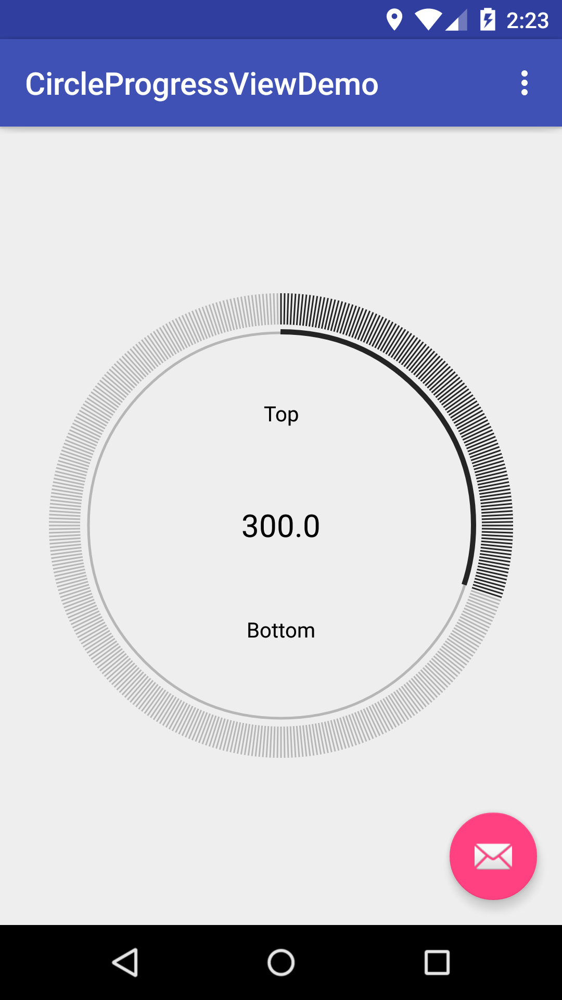

# CircleProgressView

CircleProgressView is based on [CircleTimerView](https://github.com/jiahuanyu/CircleTimerView)




## usage
```
<!-- layout_width must equals layout_height -->
<com.ivan.circleprogressview.CircleProgressView
    android:id="@+id/circleprogressview"
    android:layout_width="300dp"
    android:layout_height="300dp"
    android:layout_centerInParent="true"
    app:bottomText="Bottom"
    app:bottomTextVisible="true"
    app:gapBetweenCircleAndLine="6dp"
    app:lineCount="400"
    app:lineLength="20dp"
    app:lineWidth="1dp"
    app:topText="Top"
    app:topTextVisible="true" />
```
```java
CircleProgressView mCircleProgressView = (CircleProgressView)findViewById(R.id.circleprogressview);
mCircleProgressView.setTarget(1000);
mCircleProgressView.setCurrentCount(300);
```
